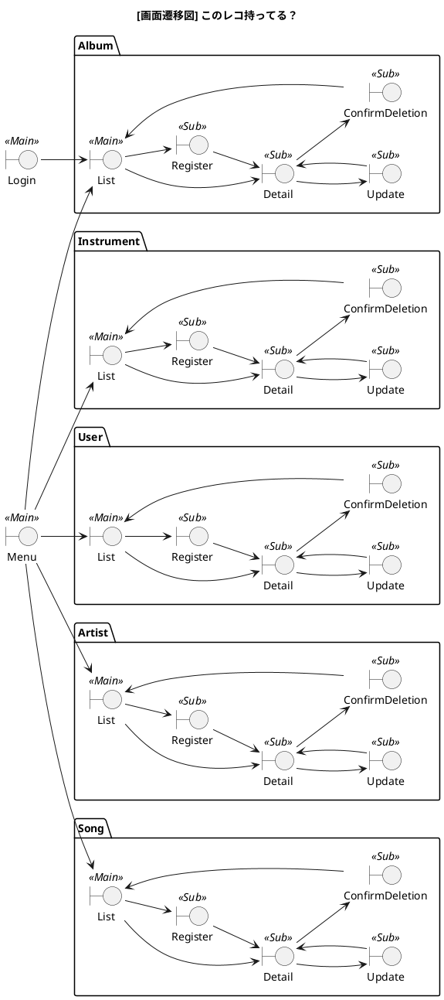
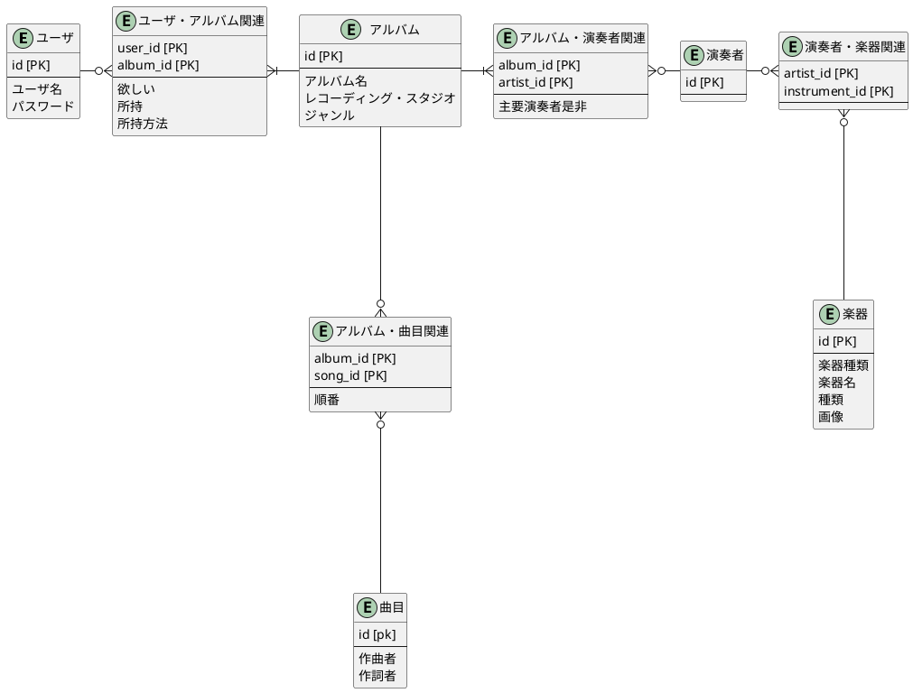
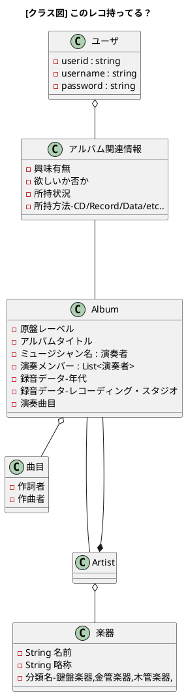

# このレコ持ってる？

## aaaa

### xxシステム説明

## 機能説明

### 機能一覧

| 機能分類 | 概要 |
| :-- | :--  |
|ユーザ管理||
|ログイン||
|アルバム管理||
|演奏者管理||
|曲目管理||
|楽器管理||

### 機能説明a

#### ログイン

#### アルバム管理（登録／更新／削除／照会）

#### 演奏者管理（登録／更新／削除／照会）

#### 曲目管理（登録／更新／削除／照会）

#### スタジオ管理（登録／更新／削除／照会）

#### 楽器管理（登録／更新／削除／照会）／楽器の種類管理（登録／更新／削除／照会）

#### ユーザ管理（登録／更新／削除／照会）

## 画面遷移図

## ER-Diagram

## クラス図

## 雑記メモ

1. ウィズ・メイ
2. トゥ・ノット・ワン
3. バード・フード
4. カユウ
5. バークシア・ブルース
6. ダイヴァーシティ
7. 三日月
8. ニア・ザ・クラウズ
9. ビーウィッチド
10. サマータイム
11. ホエン・ジョアンナ・ラブド・ミー

[パーソネル]
纐纈歩美(as)
スヴェイン・オラヴ・ハーシュタ(p)
マグネ・トルモッドゥサーテル(b)
ペロオッドヴァ・ヨハンセン(ds)

[発売元]ポニーキャニオン

原盤レーベル
アルバム・タイトル
ミュージシャン名
演奏メンバー
録音データ
  年代
  レコーディング・スタジオ
演奏曲目

楽器

* 以下を分類するのはあとでやることにした簡単化を測る
  * 楽器の種類
  * 原盤レーベル
  * 録音データ
    * 年代
    * レコーディングスタジオ
  * 曲目ごとの演奏者や楽器